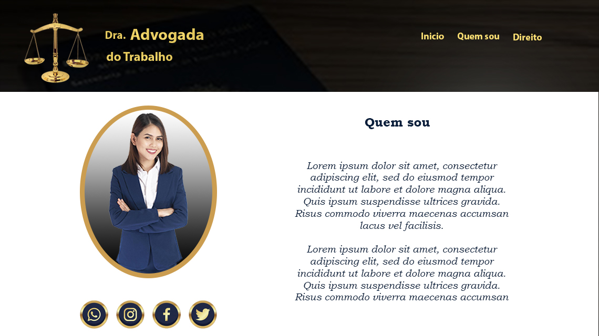

# Advogada Landing Page

Este é um projeto de **Landing Page** desenvolvido para advogados(as), com foco em apresentar os serviços, valores e facilitar o contato com potenciais clientes.

## Índice

- [Visão Geral](#visão-geral)
- [Tecnologias Utilizadas](#tecnologias-utilizadas)
- [Funcionalidades](#funcionalidades)
- [Capturas de Tela](#capturas-de-tela)
- [Como Rodar o Projeto](#como-rodar-o-projeto)
- [Contribuições](#contribuições)
- [Licença](#licença)

## Visão Geral

Este projeto foi criado para fornecer uma interface moderna e acessível para advogados(as) que desejam uma presença online profissional. A página inclui seções sobre os serviços oferecidos, informações de contato e uma seção para marcar consultas.

### Tecnologias Utilizadas

- HTML5
- CSS3
- JavaScript (opcionalmente para futuras funcionalidades)
- Fontes e ícones de fontes da [Google Fonts](https://fonts.google.com/) e [Font Awesome](https://fontawesome.com/)

## Funcionalidades

- **Design Responsivo:** Layout que se adapta a diferentes tamanhos de tela, tornando a navegação agradável tanto em dispositivos móveis quanto em desktops.
- **Seção de Serviços:** Espaço dedicado para listar os principais serviços oferecidos.
- **Formulário de Contato:** Área para que potenciais clientes possam enviar mensagens diretamente pelo site.

## Capturas de Tela

### Inicio


### Quem sou



### Direito


## Como Rodar o Projeto

1. Clone o repositório:
   ```bash
   git clone https://github.com/nahinMSM/Advogada-Landing-page.git
   ```
2. Navegue até o diretório do projeto:
   ```bash
   cd Advogada-Landing-page
   ```
3. Abra o arquivo `index.html` no navegador para visualizar a página.

## Contribuições

Contribuições são sempre bem-vindas! Sinta-se à vontade para abrir uma [issue](https://github.com/nahinMSM/Advogada-Landing-page/issues) ou enviar um pull request.

## Licença

Este projeto está licenciado sob a licença MIT. Veja o arquivo [LICENSE](./LICENSE) para mais detalhes.
